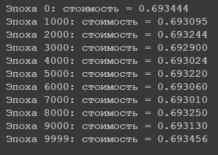
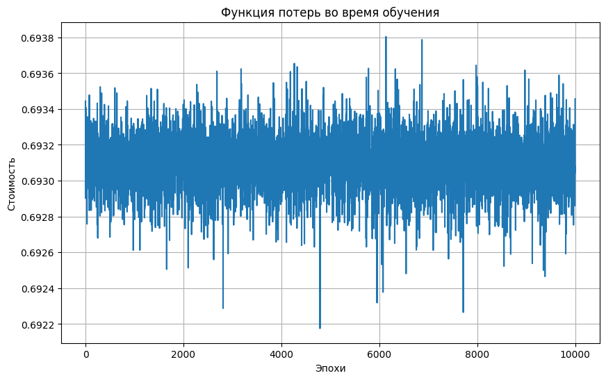
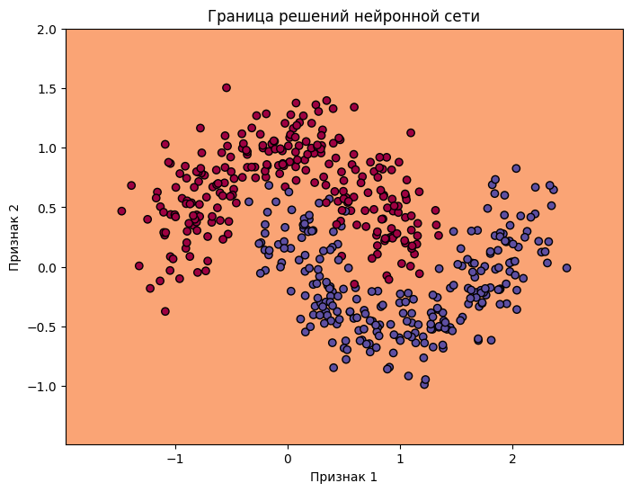
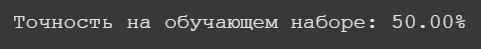

# Лабораторная работа №3: Реализация алгоритма обратного распространения ошибки

## Цель работы
Изучить и реализовать алгоритм обратного распространения ошибки для обучения многослойной полносвязной нейронной сети на языке Python с использование объектно-ориентированного подхода.

## Реализовано

1. **Реализованы функции активации** и их производные:
- Сигмоида (`sigmoid`)
- ReLU (`relu`)
- tanh (`tanh`)

2. **Класс `NuralNetwork`**, реализующий:
- Инициализацию весов и смещений для каждого слоя
- Прямое распространение сигнала (forward propagation)
- Вычисление функции потерь (кросс-энтропия)
- Алгоритм обратного распространения ошибки (backpropagation)
- Обновление параметров с использованием градиентного спуска

3. **Поддержка нескольких слоев** и разных функций активации, что делает сеть гибкой для различных задач.

4. **Использованы словари** для хранения параметров, кешей и градиентов на каждом шаге.

## Результат

В ходе лабораторной работы была построена и обучена простая полносвязная нейронная сеть, способная обучаться на наборе данных с использованием реализованного алгоритма обратного распространения ошибки.

# Генерация данных "Две луны"

.png)

# Определение архитекутры и обучение сети

# Визуализация функции потерь

# Визуализации границы решений

# Оценка точности (Accuracy)

## Выводы

- Алгоритм backpropogation позвоялет эффективног обучать многослойные нейросети путем вычисления градиентов ошибки по слоям.
- Такая реализация помогает лучше понять внутрении процессы обучения нейросетей, включая взаимодействие слоев, роль производных и обновление параметров.
